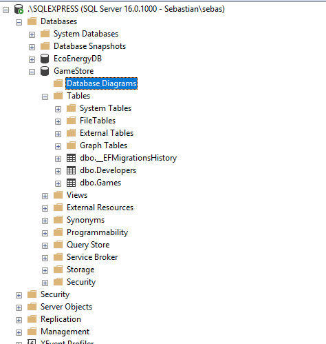
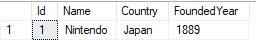
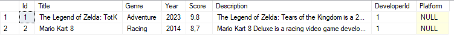
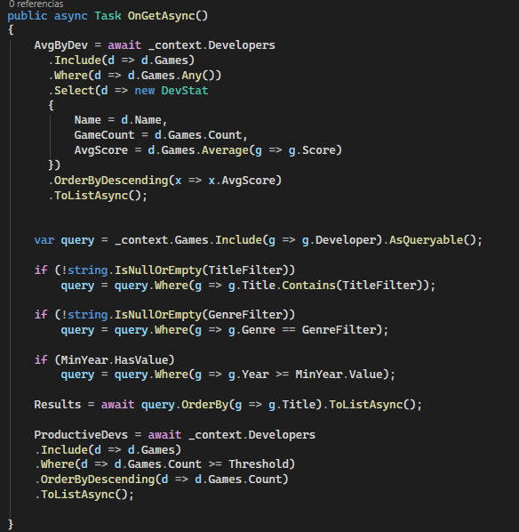

# VideoGameManager-EF
Este proyecto consiste en una aplicación web desarrollada con ASP.NET Core Razor Pages diseñada para la gestión de videojuegos y desarrolladores. Parte de un sistema de gestión por ficheros a la implementación con base de datos usando Entity Framework Core.

## Estructura del Proyecto


*   /Data: Contiene el `GameStoreContext.cs` para la gestión de la base de datos.
*   /Migrations: Historial de versiones de la base de datos.
*   /Models: Definición de las modelos `Game.cs` y `Developer.cs`.
*   /Pages: 
    *   DevelopersPages: Gestión de desarrolladores (Index, Details, Delete).
    *   Games: Gestión principal de videojuegos.
    *   Stats: Consultas avanzadas y estadísticas LINQ.

## Instrucciones de Ejecución

### 1. Instalación de Dependencias
Primero se agregaron los paquetes de NuGet necesarios para trabajar con SQL Server y las herramientas de Entity Framework:

```bash
dotnet add package Microsoft.EntityFrameworkCore
dotnet add package Microsoft.EntityFrameworkCore.SqlServer
dotnet add package Microsoft.EntityFrameworkCore.Tools
dotnet add package Microsoft.EntityFrameworkCore.Design
dotnet tool install --global dotnet-ef
```

### 2. Configuración de la Base de Datos
Se configuró la conexión a la base de datos local en el archivo appsettings.json. Luego, en el Program.cs, se agregó el servicio de DbContext:

```C#
builder.Services.AddDbContext<GameStoreContext>(options =>
    options.UseSqlServer(builder.Configuration.GetConnectionString("DefaultConnection")));
```
Esto sirve para gestionar el contexto de nuestra base de datos en el contenedor de dependencias de la aplicación. Esto permite que el sistema sepa cómo conectarse a SQL Server usando la configuración que pusimos en el appsettings.json y que podamos usarlo en nuestras páginas para consultar datos.

### 3. Migraciones
Para crear las tablas a partir de los modelos Game y Developer, ejecutamos:

```Bash
dotnet ef migrations add InitialCreate
dotnet ef database update
```
Durante la migracion tuve un fallo ya que es necesario tener todo guardado. Si escribes código en los modelos y no guardas antes de lanzar la migración, los cambios recientes no se verán reflejados en la base de datos.




### 4. Evolución del Proyecto
Del Fichero a la Base de Datos
Modificamos el Index del proyecto anterior para que, en lugar de usar clases de servicio que gestionaban ficheros (JSON, CSV, XML), ahora acepte el DbContext. Con esto, gestionamos la conexión y el uso de datos directamente con SQL Server.




### 5. Consultas LINQ y Asincronía
Se implementó el uso de async y await en los métodos OnGet.Esto funciona como una corrutina. Permite que la página se ejecute sin tener que esperar bloqueada a los datos, cuando los datos están listos, el await los recibe. Así evitamos crasheos o tiempos de espera molestos para el usuario.



Consultas implementadas:

- Filtrado y ordenación por género.
- Top 5 de juegos mejor valorados.
- Conteo de juegos por década.
- Uso de formularios para filtrar simultáneamente por nombre, género y año.
- Promedio de developer segun la puntuacion de sus juegos asociados.
- Cantidad de juegos por desarrollador.


